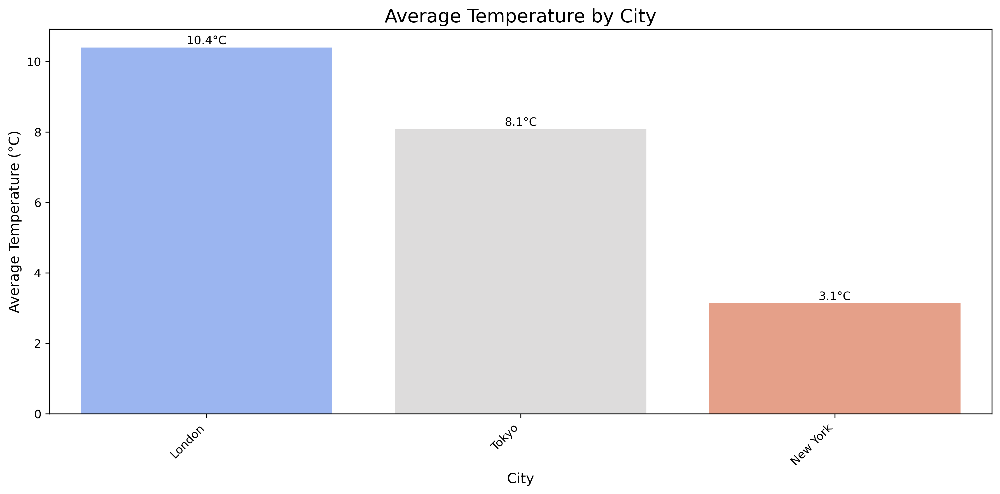

# Weather Data Processing Pipeline

This project implements a simple data pipeline to ingest, clean, transform, and analyze weather data from a CSV file. The processed data is saved as a new CSV file, and an optional report and a bar chart are generated.
[Read the detailed Analysis Report](https://docs.google.com/document/d/1W_1115ldNuhgLYnRRNkRyYsy8vEtErHYqj_LgApXn6I/edit?usp=sharing)

## Features

- Loads weather data from CSV file
- Handles missing values and standardizes date formats
- Converts temperature units (Celsius to Fahrenheit)
- Filters out invalid weather conditions
- Generates analysis reports and visualizations

## Requirements

- Python 3.7+
- pandas
- numpy
- matplotlib and Seaborn (for visualization)

## Installation

1. Clone the repository:
   ```bash
   git clone https://github.com/der-bew/Weather_data_pipeline.git
   cd Weather_data_pipeline
   ```

2. Install the required packages:
   ```bash
   pip install -r requirements.txt
   ```

## Usage

1. Place your weather data in the `data` directory as `weather_data.csv`
2. Run the pipeline:
   ```bash
   python weather_pipeline.py
   ```
3. Find the processed data in the `outputs` directory:
   - `transformed_weather_data.csv`: Cleaned and processed data
   - `basic_stats.csv`: Basic statistics
   - `city_stats.csv`: Statistics by city
   - `weather_freq.csv`: Weather condition frequencies
   - `top_cities_report.md`: Report of top 5 warmest cities
   - `avg_temperature_by_city.png`: Visualization of average temperatures

## Project Structure

```
Weather_data_pipeline/
├── data/
│   └── weather_data.csv       # Input data
├── tests/
│   └── test_weather_pipeline.py # Test file for interactive analysis
├── outputs/                   # Output files
├── weather_pipeline.py        # Main pipeline script
├── requirements.txt           # Dependencies
└── README.md                 # This file
```

## Approach

1. **Data Ingestion**: The pipeline reads the CSV file using pandas, handling different date formats.
2. **Data Cleaning**:
   - Drops rows with missing dates
   - Fills missing numeric values with city-wise medians
   - Standardizes weather condition text
3. **Transformation**:
   - Converts temperature to Fahrenheit
   - Adds date components (year, month, day)
   - Filters out 'Unknown' weather conditions
4. **Analysis**:
   - Calculates basic statistics
   - Generates city-wise summaries
   - Creates a report of top 5 warmest cities
   - Produces a bar chart of average temperatures by city
## Challenges Faced

1. **Date Parsing**: Handled multiple date formats in the input data.
2. **Missing Data**: Implemented city-wise imputation for missing values.
3. **Data Validation**: Added checks for required columns and data quality.

## Sample Output (Bonus Visualization)

The `avg_temperature_by_city.png` image file will be generated in the `outputs/` folder. It will display a bar chart visualizing the average `temperature_celsius` for each city present in the final processed data.


